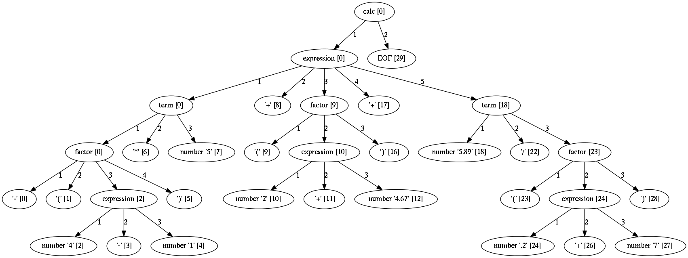

# Parser configuration

This section describes how to alter parser default behaviour.

---

There are some aspect of parsing that can be configured using parser and/or
`ParsingExpression` parameters.  Arpeggio has some sane default behaviour but
gives the user possibility to alter it.

This section describes various parser parameters.


## Case insensitive parsing

By default Arpeggio is case sensitive. If you wish to do case insensitive
parsing set parser parameter `ignore_case` to `True`.

```python
parser = ParserPython(calc, ignore_case=True)
```


## White-space handling

Arpeggio by default skips white-spaces. You can change this behaviour with the
parameter `skipws` given to parser constructor.

```python
parser = ParserPython(calc, skipws=False)
```

You can also change what is considered a whitespace by Arpeggio using the `ws`
parameter. It is a plain string that consists of white-space characters. By
default it is set to `"\t\n\r "`.

For example, to prevent a newline to be treated as whitespace you could write:

```python
parser = ParserPython(calc, ws='\t\r ')
```

!!! note
    These parameters can be used on the ``Sequence`` level so one could write
    grammar like this:

        def grammar():     return Sequence("one", "two", "three", skipws=False),
                                           "four"
        parser = ParserPython(grammar)
        pt = parser.parse("onetwothree four")


## Keyword handling

By setting a `autokwd` parameter to `True` a word boundary match for
keyword-like matches will be performed.

This parameter is disabled by default.

      def grammar():     return "one", "two", "three"

      parser = ParserPython(grammar, autokwd=True)

      # If autokwd is enabled this should parse without error.
      parser.parse("one two three")

      # But this will not parse as the match is done using word boundaries
      # so this is considered a one word.
      parser.parse("onetwothree")


## Comment handling

Support for comments in your language can be specified as another set of
grammar rules.  See [simple.py
example](https://github.com/textX/Arpeggio/blob/master/examples/simple/).

Parser is constructed using two parameters.

```python
parser = ParserPython(simpleLanguage, comment)
```

First parameter is the root rule of main parse model while the second is a rule
for comments.

During parsing comment parse trees are kept in the separate list thus comments
will not show in the main parse tree.


## Parse tree reduction

Non-terminals are by default created for each rule. Sometimes it can result in
trees of great depth.  You can alter this behaviour setting `reduce_tree`
parameter to `True`.

```python
parser = ParserPython(calc, reduce_tree=True)
```

In this configuration non-terminals with single child will be removed from the
parse tree.

For example, `calc` parse tree above will look like this:

<a href="../images/calc_parse_tree_reduced.dot.png" target="_blank"></a>

Notice the removal of each non-terminal with single child.

!!! warning
    Be aware that [semantic analysis](semantics.md) operates on nodes of
    finished parse tree. Therefore, it you use [tree
    reduction](configuration.md#parse-tree-reduction) visitor methods will not
    get called for the removed nodes.


## Newline termination for Repetitions

By default `Repetition` parsing expressions (i.e. `ZeroOrMore` and
`OneOrMore`) will obey `skipws` and `ws` settings but there are situations
where repetitions should not pass the end of the current line. For this feature
`eolterm` parameter is introduced which can be set on a repetition and will
ensure that it terminates before entering a new line.

    def grammar():      return first, second
    def first():        return ZeroOrMore(["a", "b"], eolterm=True)
    def second():       return "a"

    # first rule should match only first line
    # so that second rule will match "a" on the new line
    input = """a a b a b b
    a"""

    parser = ParserPython(grammar)
    result = parser.parse(input)
    
## Separator for Repetitions

It is possible to specify parsing expression that will be used in between each
two matches in repetitions.

For example:

    def grammar():        return ZeroOrMore(["a", "b"], sep=",")

    # so that second rule will match "a" on the new line
    input = "a , b, b, a"

    parser = ParserPython(grammar)
    result = parser.parse(input)

`sep` can be any valid parsing expression.

### Memoization (a.k.a. packrat parsing)

This technique is based on memoizing result on each parsing expression rule.
For some grammars with a lot of backtracking this can yield a significant
speed increase at the expense of some memory used for the memoization cache.

Starting with Arpeggio 1.5 this feature is disabled by default.  If you think
that parsing is slow, try to enable memoization by setting `memoization`
parameter to `True` during parser instantiation.

```python
parser = ParserPython(grammar, memoization=True)
```

