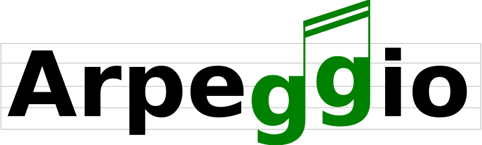

Arpeggio is recursive descent parser with backtracking and memoization (a.k.a.
pacrat parser).  Arpeggio grammars are based on [PEG
formalism](http://en.wikipedia.org/wiki/Parsing_expression_grammar).

Arpeggio's main use is a foundation for a tool-chain for DSL development but it
can be used for all sort of general purpose parsing.

For more information on PEG and packrat parsers see [this
page](http://bford.info/packrat/).

For a higher level library for building DSLs take a look at
[textX](https://github.com/textX/textX). It builds on top of Arpeggio
and makes language parser implementation a lot easier.

See [Getting started](getting_started.md) in the `User Guide` menu to get you going or read some of the
tutorials.

## Features

- Using [Parsing Expression Grammar](http://en.wikipedia.org/wiki/Parsing_expression_grammar)
  and packrat parsing - unambiguous grammars, unlimited lookahead, linear time.
- Works as grammar interpreter - no code is generated.
- Multiple syntaxes for grammar definition ([Python](grammars.md#grammars-written-in-python), 
  [peg, cleanpeg](grammars.md#grammars-written-in-peg-notations), make your own)
* [Case sensitive/insensitive
  parsing](configuration.md#case-insensitive-parsing)
* [Whitespace handling control](configuration.md#white-space-handling)
* [Keyword handling](configuration.md#keyword-handling)
* [Support for comments](configuration.md#comment-handling)
* [Newline termination for
  Repetition](configuration.md#newline-termination-for-repetitions) (available only in Python syntax)
* [Parse tree navigation](parse_trees.md)
* [Visitors for semantic analysis](semantics.md)
* [Extensive error reporting](handling_errors.md)
* [Good support for debugging and visualization](debugging.md)
* [Good test coverage](https://github.com/textX/Arpeggio/tree/master/tests/unit)
* Beautiful mkdocs documentation - you are reading it

## Python versions

Arpeggio works with Python 2.7, 3.3+. Other versions might work but are not
tested.

## Open-source projects using Arpeggio

- [textX](https://github.com/textX/textX) - Meta-language for building
  Domain-Specific Languages in Python (and all projects using textX)
- [whatami](https://github.com/sdvillal/whatami) - Unobtrusive object
  self-identification for Python
  ([parsers](https://github.com/sdvillal/whatami/blob/master/whatami/parsers.py)
  module)
- [ithkuil](https://github.com/fizyk20/ithkuil) - A Python package providing
  tools for analysing texts in the [Ithkuil](http://ithkuil.net/) constructed language.

## Why is it called arpeggio?

In music, arpeggio is playing the chord notes one by one in sequence. I came up
with the name by thinking that parsing is very similar to arpeggios in music.
You take tokens one by one from an input and make sense out of it – make a
chord!

Well, if you don't buy this maybe it is time to tell you the truth. I searched
the dictionary for the words that contain PEG acronym and the word arpeggio was
at the top of the list ;)

## Citing Arpeggio

If you use Arpeggio please cite this paper:

Dejanović I., Milosavljević G., Vaderna R.: Arpeggio: A flexible PEG parser for
Python, Knowledge-Based Systems, 2016, 95, 71 - 74,
[doi:10.1016/j.knosys.2015.12.004](http://dx.doi.org/10.1016/j.knosys.2015.12.004)

